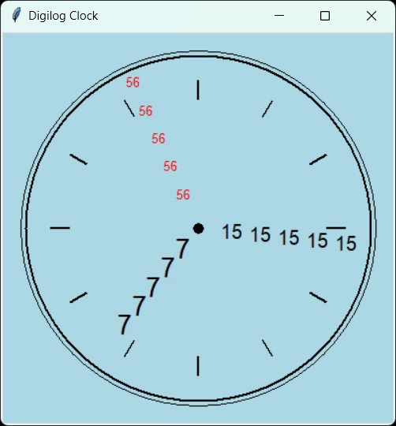
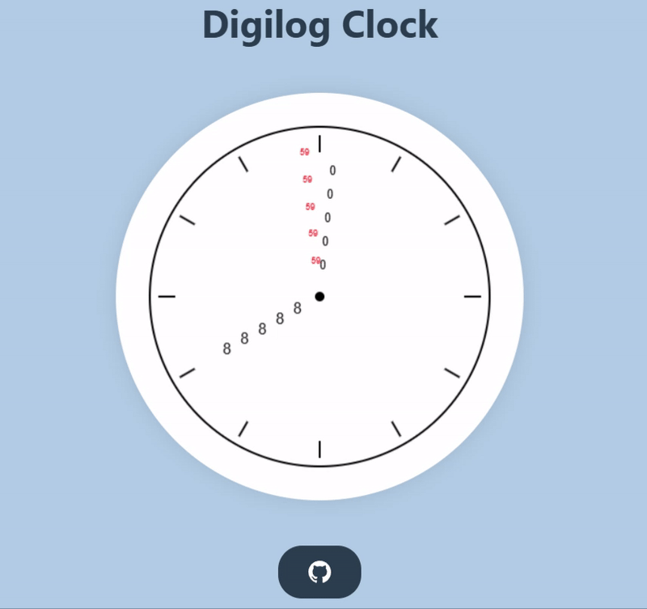

# Digilog Clock 🕐

## Description
Digilog Clock is made using Python with Tkinter that shows the time in which hands are made up of the actual time digits.

## Features
- **Dynamic Clock Hands**: The hour, minute, and second hands are constructed from repeating digits of the current time.
  - For example, if the time is **06:15:23**, the hour hand displays **06 06 06 06 06**, the minute hand displays **15 15 15 15 15**, and the second hand displays **23 23 23 23 23**.
- **Real-Time Update**: The clock updates every second to reflect the current time.

## Visual
### Python App

<a href="https://github.com/Manish-Let-It-Be/Digilog-Clock">
    
</a>

### Web App

<a href="https://github.com/Manish-Let-It-Be/Digilog-Clock">
    
</a>

## Installation
To run the Digilog Clock application, follow these steps:

1. Ensure you have Python installed on your machine.
2. Install Tkinter:
   ```bash
   pip install tkinter
   ```
3. Clone the repository:
   ```bash
   git clone https://github.com/Manish-Let-It-Be/Digilog-Clock.git
   ```
4. Navigate to the project directory:
   ```bash
   cd Digilog-Clock 
   ```

## Usage
To run the application, execute the following command in your terminal:
```bash
python clock.py
```

## Contributing

Contributions are welcome! If you have any suggestions or find any issues, please feel free to open a new issue or submit a pull request.


---

<p align="center">
  
</p>
